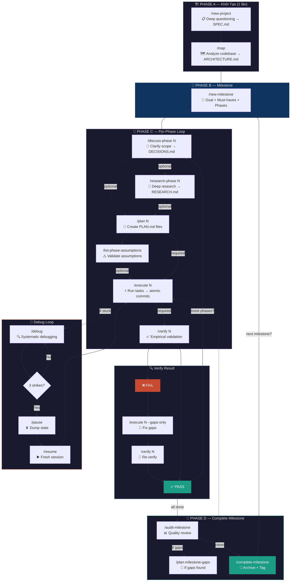
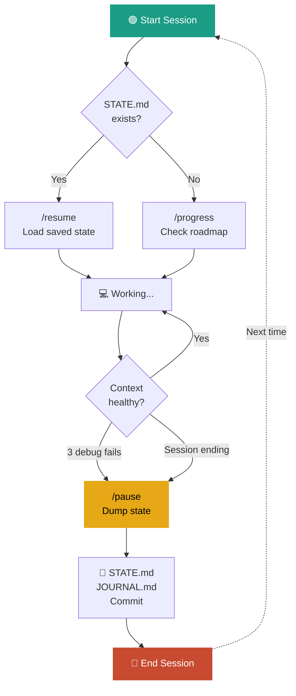
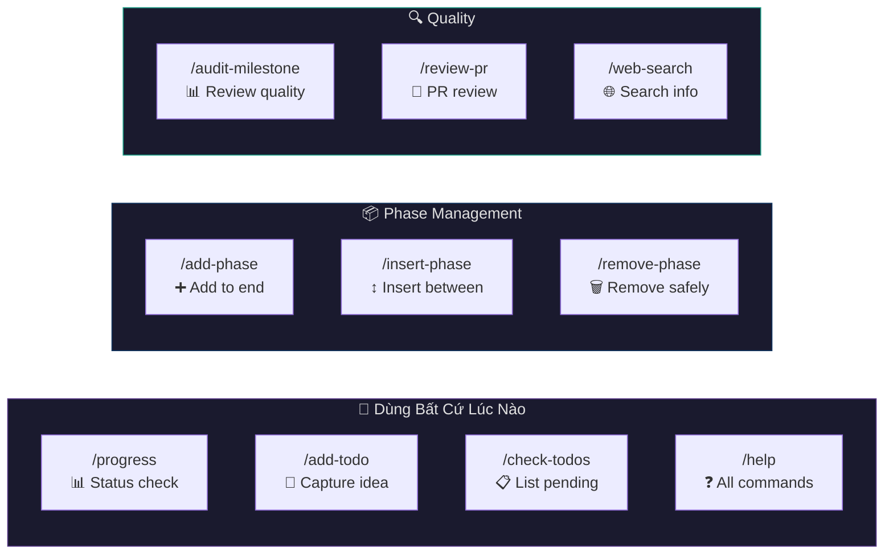
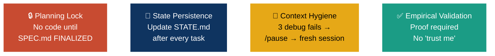

# GSD Workflow — Complete Reference

## Lifecycle Tổng Quan

```mermaid
flowchart TD
    subgraph INIT["🏗️ PHASE A — Khởi Tạo (1 lần)"]
        A1["/new-project\n📋 Deep questioning → SPEC.md"]
        A2["/map\n🗺️ Analyze codebase → ARCHITECTURE.md"]
        A1 --> A2
    end

    subgraph MILESTONE["🎯 PHASE B — Milestone"]
        B1["/new-milestone\n🎯 Goal + Must-haves + Phases"]
    end

    subgraph PHASE_LOOP["🔄 PHASE C — Per-Phase Loop"]
        direction TB
        C1["/discuss-phase N\n💬 Clarify scope → DECISIONS.md"]
        C2["/research-phase N\n🔬 Deep research → RESEARCH.md"]
        C3["/plan N\n📝 Create PLAN.md files"]
        C4["/list-phase-assumptions\n⚠️ Validate assumptions"]
        C5["/execute N\n⚡ Run tasks → atomic commits"]
        C6["/verify N\n✅ Empirical validation"]

        C1 -.->|optional| C2
        C1 -.->|optional| C3
        C2 -.->|optional| C3
        C3 --> C4
        C4 -.->|optional| C5
        C3 -->|required| C5
        C5 -->|required| C6
    end

    subgraph VERIFY_RESULT["🔍 Verify Result"]
        V_PASS["✅ PASS"]
        V_FAIL["❌ FAIL"]
        V_GAPS["/execute N --gaps-only\n🔧 Fix gaps"]
        V_REVERIFY["/verify N\n🔁 Re-verify"]

        V_FAIL --> V_GAPS --> V_REVERIFY --> V_PASS
    end

    subgraph DEBUG_LOOP["🐛 Debug Loop"]
        D1["/debug\n🔍 Systematic debugging"]
        D2{"3 strikes?"}
        D3["/pause\n⏸️ Dump state"]
        D4["/resume\n▶️ Fresh session"]

        D1 --> D2
        D2 -->|No| D1
        D2 -->|Yes| D3
        D3 --> D4
        D4 --> C5
    end

    subgraph COMPLETE["🎉 PHASE D — Complete Milestone"]
        E1["/audit-milestone\n📊 Quality review"]
        E2["/plan-milestone-gaps\n🔧 If gaps found"]
        E3["/complete-milestone\n🏁 Archive + Tag"]

        E1 -.->|if gaps| E2
        E2 -.-> C5
        E1 -->|clean| E3
    end

    A2 --> B1
    B1 --> C1
    C6 --> V_PASS
    C6 --> V_FAIL
    V_PASS -->|more phases?| C1
    V_PASS -->|all done| E1
    C5 -.->|if stuck| D1
    E3 -->|next milestone?| B1

    style INIT fill:#1a1a2e,stroke:#16213e,color:#e0e0e0
    style MILESTONE fill:#0f3460,stroke:#16213e,color:#e0e0e0
    style PHASE_LOOP fill:#1a1a2e,stroke:#533483,color:#e0e0e0
    style VERIFY_RESULT fill:#1a1a2e,stroke:#2b6777,color:#e0e0e0
    style DEBUG_LOOP fill:#1a1a2e,stroke:#c84b31,color:#e0e0e0
    style COMPLETE fill:#1a1a2e,stroke:#1b9c85,color:#e0e0e0

    style V_PASS fill:#1b9c85,stroke:#1b9c85,color:#fff
    style V_FAIL fill:#c84b31,stroke:#c84b31,color:#fff
    style E3 fill:#1b9c85,stroke:#1b9c85,color:#fff
```

## Per-Phase Execution Detail

```mermaid
flowchart LR
    subgraph PLAN["📝 Planning"]
        P1["Read SPEC.md\nROADMAP.md"]
        P2["Decompose\ninto tasks"]
        P3["Write PLAN.md\n2-3 tasks max"]
        P4["Verify plan\nChecker logic"]

        P1 --> P2 --> P3 --> P4
    end

    subgraph EXEC["⚡ Execution"]
        E1["Load PLAN.md"]
        E2["Execute task"]
        E3["Run verify cmd"]
        E4["git commit\natomic"]
        E5["Create\nSUMMARY.md"]

        E1 --> E2 --> E3 --> E4
        E4 -->|more tasks| E2
        E4 -->|done| E5
    end

    subgraph VERIFY["✅ Verification"]
        V1["Extract\nmust-haves"]
        V2["Run empirical\nchecks"]
        V3["Capture\nevidence"]
        V4["Write\nVERIFICATION.md"]

        V1 --> V2 --> V3 --> V4
    end

    P4 --> E1
    E5 --> V1

    style PLAN fill:#0f3460,stroke:#16213e,color:#e0e0e0
    style EXEC fill:#533483,stroke:#16213e,color:#e0e0e0
    style VERIFY fill:#1b9c85,stroke:#16213e,color:#e0e0e0
```

## Session Management

```mermaid
flowchart TD
    START["🟢 Start Session"] --> RESUME{STATE.md\nexists?}
    RESUME -->|Yes| R1["/resume\nLoad saved state"]
    RESUME -->|No| R2["/progress\nCheck roadmap"]

    R1 --> WORK["💻 Working..."]
    R2 --> WORK

    WORK --> CHECK{"Context\nhealthy?"}
    CHECK -->|Yes| WORK
    CHECK -->|3 debug fails| PAUSE["/pause\nDump state"]
    CHECK -->|Session ending| PAUSE

    PAUSE --> SAVE["💾 STATE.md\nJOURNAL.md\nCommit"]
    SAVE --> END["🔴 End Session"]

    END -.->|Next time| START

    style START fill:#1b9c85,stroke:#1b9c85,color:#fff
    style END fill:#c84b31,stroke:#c84b31,color:#fff
    style PAUSE fill:#e6a817,stroke:#e6a817,color:#000
```

## Utility Commands

```mermaid
flowchart LR
    subgraph ANYTIME["🔧 Dùng Bất Cứ Lúc Nào"]
        U1["/progress\n📊 Status check"]
        U2["/add-todo\n📌 Capture idea"]
        U3["/check-todos\n📋 List pending"]
        U4["/help\n❓ All commands"]
    end

    subgraph PHASE_MGMT["📦 Phase Management"]
        PM1["/add-phase\n➕ Add to end"]
        PM2["/insert-phase\n↕️ Insert between"]
        PM3["/remove-phase\n🗑️ Remove safely"]
    end

    subgraph QUALITY["🔍 Quality"]
        Q1["/audit-milestone\n📊 Review quality"]
        Q2["/review-pr\n🔎 PR review"]
        Q3["/web-search\n🌐 Search info"]
    end

    style ANYTIME fill:#1a1a2e,stroke:#533483,color:#e0e0e0
    style PHASE_MGMT fill:#1a1a2e,stroke:#0f3460,color:#e0e0e0
    style QUALITY fill:#1a1a2e,stroke:#1b9c85,color:#e0e0e0
```

## 4 Core Rules

```mermaid
flowchart LR
    R1["🔒 Planning Lock\nNo code until\nSPEC.md FINALIZED"]
    R2["💾 State Persistence\nUpdate STATE.md\nafter every task"]
    R3["🧹 Context Hygiene\n3 debug fails →\n/pause → fresh session"]
    R4["✅ Empirical Validation\nProof required\nNo 'trust me'"]

    R1 ~~~ R2 ~~~ R3 ~~~ R4

    style R1 fill:#c84b31,stroke:#c84b31,color:#fff
    style R2 fill:#0f3460,stroke:#0f3460,color:#fff
    style R3 fill:#e6a817,stroke:#e6a817,color:#000
    style R4 fill:#1b9c85,stroke:#1b9c85,color:#fff
```
